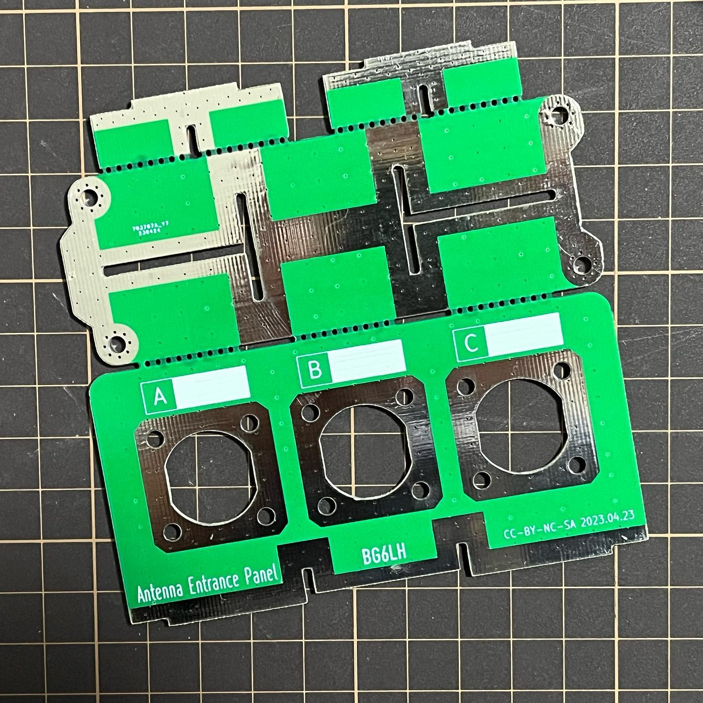

# Antenna Entrance Panel PCB
A PCB desgin for antenna entrance mounting

Broking the PCB along the stamp holes, crossing support and soldering together by a iron.

Here is a finnal picture.

It could be mounted where you need antennna cables entranced. the mounting holes and the screw holes are all contacted to GND together.

I made this design to drain common mode current away from my antenna-feedline system.

You are welcome to download remodify it.

This desgin is licensed under CC-BY-NC-SA.

73

BG6LH

